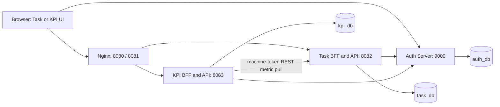

# Enterprise Task & KPI Platform — Developer Guideline

Source review date: 2026-10-06. Reviewed repository: `enterprise-task-kpi-platform`, commit `59f52b8ee4fdf5493ed078238716b612f1123dae` and the working-tree source available at review time.

This document is stored in the **project root**. Commands below run from the repository root unless another directory is specified. Replace the example checkout path with your own. Example UUIDs, timestamps and token strings are illustrative; no real credentials appear here.

The guide is based on controllers, DTOs, services, security filters, Flyway migrations, Maven/npm manifests, Dockerfiles, Compose, frontend code, setup utilities and tests. Commands are derived from those sources; the platform was **not rebuilt, started or seeded during this documentation task**. Existing verification reports are historical evidence, not a new test run.

## Contents

1. [What the project implements](#1-what-the-project-implements)
2. [Architecture and repository layout](#2-architecture-and-repository-layout)
3. [Prerequisites](#3-prerequisites)
4. [Configuration and credentials](#4-configuration-and-credentials)
5. [Fresh local setup](#5-fresh-local-setup)
6. [Application usage](#6-application-usage)
7. [Authentication and curl preparation](#7-authentication-and-curl-preparation)
8. [Complete HTTP API reference](#8-complete-http-api-reference)
9. [Running individual components](#9-running-individual-components)
10. [Builds, tests and observability](#10-builds-tests-and-observability)
11. [Troubleshooting](#11-troubleshooting)
12. [Stopping, restarting and resetting](#12-stopping-restarting-and-resetting)
13. [Verification boundaries and unavailable components](#13-verification-boundaries-and-unavailable-components)

## 1. What the project implements

This platform manages team tasks through a controlled lifecycle and derives employee, team and company performance metrics from those tasks. Identity, authoritative task data and derived reporting data are separated into three services.

| Component | Implemented responsibility |
| --- | --- |
| Auth Server | PostgreSQL-backed users/roles, email/password login, Argon2id hashing, OAuth 2.0 authorization-code and refresh grants, OIDC discovery/UserInfo, RSA-signed JWTs, grant/consent persistence, revocation/introspection, machine-client credentials, CSRF-protected session logout, login rate limiting. |
| Task Management | Task creation, approval, one-time assignment, employee start/completion, administrative close, scoped task searches/details/history, reference team/project/member reads, transactional audit, optimistic locking, durable command replay, private metric/leadership feed. |
| KPI Service | Authenticated REST pull from Task, independently stored generation-based read model, counts/percentages/completion times/scores, employee/team/company summaries, rankings/top performers, monthly trends, status distribution and freshness metadata. |
| Task web UI | Dashboard, My tasks, Team tasks, All tasks, title/status/priority filters, paginated task lists/history, task creation and lifecycle actions, subject/role profile and sign-out. |
| KPI web UI | Personal/team/company performance, rankings/top performers, date filters, monthly completion/status/overdue charts, completion time, freshness indicator, subject/role profile and sign-out. |
| Shared frontend | Plain HTML/JavaScript, Tailwind CSS, locally bundled Chart.js, escaped API values, loading/empty/error feedback and component style guide. |
| Infrastructure | One PostgreSQL container with three databases and separate migration/runtime users; Nginx serves both UIs and proxies browser BFF routes; health-ordered Compose startup; non-root application containers. |

There is **no Android application or Angular application in the available repository**. The web apps are not Angular. No Android SDK, Gradle build, emulator configuration or Angular CLI is required to run the implemented platform.

There is no public HTTP registration endpoint, user/role administration UI, team/project/member creation API, task deletion/general editing API, rejection/reopening state, push notification service or report export endpoint. An internal Java registration service exists and always creates EMPLOYEE identities; it is not exposed over HTTP. Development fixtures supply users, teams and projects.

## 2. Architecture and repository layout



The BFF (backend for frontend) lives inside each resource service, enabled by the `bff` Spring profile. It holds OAuth tokens on the server, authenticates browser requests with an HttpOnly session cookie, refreshes expired access tokens and forwards permitted API requests using bearer authentication. JavaScript receives a subject, roles and CSRF token, not OAuth access/refresh tokens.

KPI never queries `task_db` directly. It obtains a `kpi-sync` machine token from Auth and reads Task's bounded internal feed. A completed sweep publishes a new generation; an interrupted sweep preserves the previous published generation. Leadership checks for broader Team Leader KPI access call Task live rather than trusting old projection data.

```text
enterprise-task-kpi-platform/          repository root; no root pom.xml
├── AGENTS.md                         repository development contract
├── docs/                             architecture/API/security/setup/ADRs
├── requests/                         IntelliJ HTTP examples
├── scripts/                          credential, fixture and smoke utilities
└── enterprise-platform/
    ├── auth-server/                  independent Maven application
    ├── task-management/              independent Maven application
    ├── kpi-service/                  independent Maven application
    ├── frontend/                     one npm project, two HTML/JS apps
    ├── deploy/init-databases.sh       PostgreSQL first-initialization script
    ├── docker-compose.yml
    └── .env.example                  standalone Auth template
```

All Java packages begin with `com.parvez`. API boundaries use dedicated DTOs. Flyway owns schema changes; Hibernate runs with `ddl-auto=validate`, not `update`. The Maven modules are parent-less independent projects: there is no reactor command that builds all three from a root POM.

### Local network and ports

| Service | Compose-network address | Host access in supplied Compose |
| --- | --- | --- |
| PostgreSQL | `postgres:5432` | Not published. Use `docker compose exec postgres psql`. |
| Auth | `auth-server:9000` | `http://127.0.0.1:9000` |
| Task API/BFF | `task-management:8082` | API port not published; browser routes through Task UI. |
| KPI API/BFF | `kpi-service:8083` | API port not published; browser routes through KPI UI. |
| Task frontend | `frontend:8080` | `http://127.0.0.1:8080` |
| KPI frontend | `frontend:8081` | `http://127.0.0.1:8081` |
| UI test server | Not a Compose service | `http://127.0.0.1:8123`, created by Playwright for UI tests. |

Use **127.0.0.1** for the browser workflow: the seeded callback URLs and Compose issuer use that exact host. `localhost` is not interchangeable in OAuth redirect matching or issuer validation.

## 3. Prerequisites

The complete documented workflow targets Linux/POSIX shell tooling. The credential utility sets POSIX permissions and the key-access command uses Linux container group IDs. Windows/macOS-native permission handling has not been verified; a Linux environment matching the repository instructions is the verified source baseline.

| Tool/dependency | Requirement or source pin | Why |
| --- | --- | --- |
| JDK | Java 25 or newer; compiler release 25 | Maven compilation and Java source-file setup utilities. |
| Maven | Maven 3.9.x is used by the project environment/images; Docker builder pins 3.9.16 | No Maven wrapper exists. |
| Docker | Running Docker Engine, accessible daemon | Compose and PostgreSQL Testcontainers. |
| Compose | Modern `docker compose` supporting `--wait` | Service orchestration and seed utility. No exact host minimum is declared. |
| Python | Python 3 | Seeding, smoke checks, workflow helpers, UI test server and examples here. |
| unzip | Available on PATH | Extract Auth JAR crypto dependencies for utilities. |
| Node/npm | Node 24 LTS with npm | Local frontend build/test. Docker builds its own Node assets. |
| curl | Available on PATH | Health checks and API walkthrough. |
| OpenSSL | Required by Auth container smoke test | The main Java credential generator does not require OpenSSL. |
| Browser | Modern browser; Playwright Chromium for tests | UIs and automated browser coverage. |
| PostgreSQL | Compose pins 18.6 Alpine by digest | Databases; a host installation is unnecessary for Compose. |

Application dependency pins are **the repository's selected versions**, not a recommendation to independently upgrade them: Spring Boot 4.1.1, springdoc 3.1.1, Bouncy Castle 1.85.2, Tailwind/CLI 4.3.3, Chart.js 4.5.1 and Playwright 1.63.0. `docs/architecture.md` records the Boot-managed baseline: Framework 7.0.9, Security/Authorization Server 7.1.1, Hibernate 7.4.5.Final, Flyway 12.4.0, PostgreSQL JDBC 42.7.13, JUnit Jupiter/Platform 6.0.3, Mockito 5.23.0 and Testcontainers 2.0.5. Resolved dependency trees were not regenerated for this guide.

Initial builds need network access to Maven Central, the npm registry and container registries. There are no required Google/Firebase/cloud accounts, external OAuth provider, Kafka, RabbitMQ or Redis services for local use. Nginx and Java runtime images are also digest-pinned in their Dockerfiles.

Check your machine from any directory:

```bash
java -version
mvn -version
docker version
docker compose version
python3 --version
node --version
npm --version
unzip -v
curl --version
```

`mvn -version` must report the intended JDK. `docker version` must show a reachable server as well as the client.

## 4. Configuration and credentials

### 4.1 Files and ownership

| File | Purpose |
| --- | --- |
| `enterprise-platform/docker-compose.yml` | Development container definitions, database addresses, `docker,dev` profiles, internal OAuth URLs and port mappings. |
| Each service's `src/main/resources/application.yml` | Service defaults, environment variable bindings, Flyway, security, sessions, logging and Actuator. |
| `enterprise-platform/.env.example` | Standalone Auth configuration template; not the complete Compose environment. |
| `.local/stack.env` | Generated Compose database passwords, OAuth secrets/hashes and signing key ID. |
| `.local/auth/private.pem`, `public.pem` | Generated 3072-bit matching RSA signing key pair. |
| `.local/auth/authorization.env` | Shell exports for standalone Auth issuer/keys/browser-client hashes. |
| `.local/users.json` | Full-platform seeded users' emails/passwords/subjects, first team/project IDs. Read privately in your editor. |
| `.local/auth-seed.sql`, `task-seed.sql` | Explicit generated development fixtures consumed by `seed-local.py`. |
| `.local/auth/bootstrap-user.sql`, `http-client.private.env.json` | Separate older standalone HTTP walkthrough fixtures; see the warning below. |

The generator creates `.local/auth` with mode 0700 and its files with mode 0600; the key-access setup changes the two PEMs to group 10001, mode 0640 for container reads. `.local` and private HTTP environments are already ignored by the repository. Keep them private and paired with the database volume. No static/default password is supplied by this guide or the application.

**You supply:** installed tools, a working Docker daemon, free local ports and network access. **The setup utility supplies:** development database passwords, signing material, OAuth secrets and fixture passwords. For standalone databases you must provision the databases/users and provide their credentials. Production requires deliberate identity/client provisioning, HTTPS, secrets and secure cookies; the development Compose file is not a production deployment template.

### 4.2 Environment variables

Generated values are intentionally omitted below. Example URLs and usernames are safe; `<your-...>` text denotes a value you must supply and is not a usable credential.

| Variables | Meaning/default |
| --- | --- |
| `POSTGRES_PASSWORD` | Generated password for Compose operator `platform_operator`; applications do not receive this credential. |
| `AUTH_DB_PASSWORD`, `AUTH_DB_MIGRATION_PASSWORD` | Generated Auth runtime/migration passwords. |
| `TASK_DB_PASSWORD`, `TASK_DB_MIGRATION_PASSWORD` | Generated Task runtime/migration passwords. |
| `KPI_DB_PASSWORD`, `KPI_DB_MIGRATION_PASSWORD` | Generated KPI runtime/migration passwords. |
| `AUTH_DB_URL`, `TASK_DB_URL`, `KPI_DB_URL` | JDBC addresses. Inside Compose: `jdbc:postgresql://postgres:5432/auth_db`, `task_db`, `kpi_db`; on host: use `127.0.0.1` after explicitly publishing PostgreSQL. |
| `AUTH_DB_USERNAME`, `TASK_DB_USERNAME`, `KPI_DB_USERNAME` | Compose uses `auth_runtime`, `task_runtime`, `kpi_runtime`. |
| `AUTH_DB_MIGRATION_USERNAME`, `TASK_DB_MIGRATION_USERNAME`, `KPI_DB_MIGRATION_USERNAME` | Compose uses `auth_migration`, `task_migration`, `kpi_migration`. |
| `AUTH_ISSUER` | Required Auth issuer. Supplied Compose uses `http://127.0.0.1:9000`. HTTPS is required except loopback HTTP. |
| `AUTH_RSA_PRIVATE_KEY`, `AUTH_RSA_PUBLIC_KEY`, `AUTH_RSA_KEY_ID` | Required Spring resource URIs and key identifier; Compose key URIs are `file:/keys/private.pem` and `file:/keys/public.pem`. |
| `AUTH_TASK_CLIENT_SECRET_HASH`, `AUTH_KPI_CLIENT_SECRET_HASH` | Generated prefixed Argon2id hashes required by Auth dev/test browser-client migrations. |
| `AUTH_KPI_SYNC_SECRET_HASH` | Encoded machine-client secret. Optional for Auth alone; required for this platform's enabled KPI synchronization. Configured machine-client provisioning runs through the migration connection. |
| `TASK_CLIENT_SECRET`, `KPI_CLIENT_SECRET`, `KPI_SYNC_SECRET` | Generated raw confidential-client secrets. Compose maps the first two to each service's `BFF_CLIENT_SECRET`. |
| `TASK_AUTH_ISSUER`, `KPI_AUTH_ISSUER` | Expected token issuer. Standalone defaults use `http://localhost:9000`; set them to the actual issuer, normally `http://127.0.0.1:9000`. |
| `TASK_AUTH_JWK_SET_URI`, `KPI_AUTH_JWK_SET_URI` | Key retrieval URL; Compose uses `http://auth-server:9000/oauth2/jwks`. This internal hostname is intentionally different from the public issuer. |
| `TASK_JWT_AUDIENCE` | Defaults to `task-management`. KPI requires `kpi-service` in code. |
| `AUTH_SERVER_PORT`, `TASK_SERVER_PORT`, `KPI_SERVER_PORT` | Application defaults 9000, 8082, 8083. Changing application ports also requires consistent health/proxy/callback configuration. |
| `TASK_MAX_PAGE_SIZE` | Positive Task query/history cap; defaults to 100. |
| `KPI_TASK_URL`, `KPI_TOKEN_URL` | Compose uses `http://task-management:8082` and `http://auth-server:9000/oauth2/token`. |
| `KPI_SYNC_ENABLED`, `KPI_SYNC_INTERVAL_MS` | Defaults `true`, `60000`. Interval is fixed delay after each sweep, not a strict wall-clock schedule. |
| `BFF_CLIENT_SECRET` | Required when `bff` is active; distinct secret per service. |
| `BFF_AUTH_INTERNAL_URL` | OAuth token/JWKS/UserInfo base URL; Compose uses `http://auth-server:9000`. |
| `BFF_REDIRECT_URI` | Task default `http://127.0.0.1:8080/login/oauth2/code/task-management-ui`; KPI default `http://127.0.0.1:8081/login/oauth2/code/kpi-ui`. Must match registered client exactly. |
| `BFF_COOKIE_SECURE` | Defaults false for local HTTP. Set true for HTTPS deployment. |
| `SPRING_PROFILES_ACTIVE` | Compose Auth: `docker,dev`; Task/KPI: `docker,dev,bff`. Auth `prod` excludes dev/test Flyway seed location. |

Additional Spring properties: `task.cors.allowed-origins` defaults to `http://127.0.0.1:8080`; `auth.login-rate-limit.attempts=20`; `auth.login-rate-limit.window-seconds=60`; `kpi.sync-initial-delay-ms=1000`; `bff.api-url` defaults to the resource service's own loopback API address. Set these through Spring command-line properties for standalone processes when needed. Merely adding an arbitrary variable to `stack.env` does **not** pass it to containers unless Compose references/passes that variable.

### 4.3 Important distinction between two fixture sets

`PrepareDevelopment.java` writes both the complete platform fixtures and a separate standalone bootstrap employee. Their `dev.employee@example.org` identities/passwords differ. `seed-local.py` provisions the **full-platform** employee from `.local/users.json`, not the employee/password in `.local/auth/http-client.private.env.json`.

Therefore, for the full Compose platform use `.local/users.json`. Do not apply `.local/auth/bootstrap-user.sql` after full-platform seeding: it conflicts with the existing email. To use `requests/auth.http` against Compose, prepare its private environment using the appropriate user from `.local/users.json` and the generated client secret; do not blindly copy the older private environment and expect its password to work.

## 5. Fresh local setup

### Step 1 — Choose the repository root

```bash
cd /home/parvez-hossain/Downloads/enterprise-task-kpi-platform
```

For another checkout, substitute its path. The clone URL was not supplied, so no repository URL is invented here. This guideline belongs in the checkout root.

### Step 2 — Start Docker and verify all backend modules

Run these sequentially from the repository root:

```bash
mvn -f enterprise-platform/auth-server/pom.xml clean verify
mvn -f enterprise-platform/task-management/pom.xml clean verify
mvn -f enterprise-platform/kpi-service/pom.xml clean verify
```

Each command installs/downloads its Maven dependencies and builds an executable JAR. Surefire runs unit tests; Failsafe runs integration tests against disposable PostgreSQL. Tests generate their own signing/client material; your future `.local` environment is not required yet. Stop if any command fails. `mvn test` or a Docker image build does not replace `clean verify`.

### Step 3 — Generate fresh private development material once

Only run this when `.local/auth` does not exist and you intend to initialize a fresh database:

```bash
unzip -q -o enterprise-platform/auth-server/target/auth-server-0.0.1-SNAPSHOT.jar \
  'BOOT-INF/lib/*' \
  -d enterprise-platform/auth-server/target/auth-tools

java --class-path 'enterprise-platform/auth-server/target/auth-tools/BOOT-INF/lib/*' \
  scripts/com/parvez/tools/PrepareDevelopment.java

docker run --rm --user 0 \
  -v "$PWD/.local/auth:/keys" \
  --entrypoint sh postgres:18.6-alpine \
  -c 'chgrp 10001 /keys/private.pem /keys/public.pem && chmod 640 /keys/private.pem /keys/public.pem'
```

The generator refuses to overwrite existing material. Browser-client hashes are persisted by a one-time migration, so regenerating secrets while retaining an old database breaks authentication. Reuse the existing material on ordinary restarts.

### Step 4 — Validate, build and start infrastructure and applications

```bash
docker compose --env-file .local/stack.env \
  -f enterprise-platform/docker-compose.yml config --quiet

docker compose --env-file .local/stack.env \
  -f enterprise-platform/docker-compose.yml up --build -d --wait

docker compose --env-file .local/stack.env \
  -f enterprise-platform/docker-compose.yml ps
```

`config --quiet` validates interpolation without printing credentials. The build creates all Java and frontend images. The frontend Docker build runs `npm ci` and `npm run build` internally. A separate host npm build is not necessary just to use Compose.

Startup dependency order is PostgreSQL → healthy Auth → Task and KPI → frontend. Task and KPI may start concurrently; KPI retries its next scheduled sweep if Task was not ready for an initial call. `--wait` checks configured health checks; it does not prove fixture login or successful KPI publication.

On the **first initialization of an empty PostgreSQL volume**, Docker runs `deploy/init-databases.sh` automatically. It creates:

| Database | Runtime login | Migration/owner login |
| --- | --- | --- |
| `auth_db` | `auth_runtime` | `auth_migration` |
| `task_db` | `task_runtime` | `task_migration` |
| `kpi_db` | `kpi_runtime` | `kpi_migration` |

Do not run the initialization script manually or use it as a repeated migration command. Flyway inside each service creates its application tables. Auth dev migrations provision role names and the two browser clients; explicit machine configuration provisions `kpi-sync`. The named volume is normally `enterprise-platform_platform-data`.

### Step 5 — Seed development users and task data

```bash
python3 scripts/seed-local.py
```

The script requires all three backends healthy, checks explicit `dev` profiles and rejects `prod`/`production`. It provisions six users, two teams, two projects and 80 historical tasks with varied states, priorities, timestamps and audit events. Repeating it does not duplicate the generated fixture rows. It does not reset previously changed fixtures or rotate existing passwords.

Seed account keys in `.local/users.json`:

| Key | Role | Context |
| --- | --- | --- |
| `admin` | `ADMIN` | Platform-wide task decisions and reporting. |
| `manager` | `PROJECT_MANAGER` | Create/read/close tasks; company reporting. |
| `leader` | `TEAM_LEADER` | Product Engineering / Platform Launch. |
| `employee` | `EMPLOYEE` | Product Engineering assigned tasks. |
| `leader.two` | `TEAM_LEADER` | Operations / Reliability. |
| `employee.two` | `EMPLOYEE` | Operations assigned tasks. |

Passwords are generated, not defaults. Open `.local/users.json` privately in your editor; do not paste it into issue reports or logs.

### Step 6 — Verify public probes and use the apps

```bash
curl --fail-with-body http://127.0.0.1:9000/actuator/health
curl --fail-with-body http://127.0.0.1:9000/.well-known/openid-configuration
curl --fail-with-body http://127.0.0.1:8080/health
curl --fail-with-body http://127.0.0.1:8081/health

docker compose --env-file .local/stack.env \
  -f enterprise-platform/docker-compose.yml exec -T task-management \
  wget -q -O - http://127.0.0.1:8082/actuator/health

docker compose --env-file .local/stack.env \
  -f enterprise-platform/docker-compose.yml exec -T kpi-service \
  wget -q -O - http://127.0.0.1:8083/actuator/health
```

Backend health returns `{"status":"UP"}` when healthy; frontend `/health` returns `ok`. Open Task at `http://127.0.0.1:8080`, KPI at `http://127.0.0.1:8081`, click **Sign in** and use the generated account for your role. Login redirects through Auth on 9000 and returns to the registered application callback.

KPI may initially show zero after a pre-seed empty sweep, or 503 before any completed sweep. Allow approximately one normal 60-second sync interval after seeding, then refresh the view.

## 6. Application usage

### 6.1 Task workflow and authorization

```text
Admin/PM create → DRAFT
Admin/managed-team Leader approve → APPROVED
Admin/managed-team Leader assign → APPROVED, with assignee
Assigned EMPLOYEE starts → IN_PROGRESS
Assigned EMPLOYEE completes → COMPLETED
Admin/PM closes → CLOSED
```

Assignment is an additional audited action, not a status. It requires an approved, currently unassigned task and a user UUID present in that team's membership table. The Task database stores user UUIDs rather than copying Auth users/roles; assignment validates membership, not an Auth lookup. Completion/closing cannot skip stages. Closing is terminal.

| Action | ADMIN | PROJECT_MANAGER | TEAM_LEADER | EMPLOYEE |
| --- | --- | --- | --- | --- |
| Create | Yes | Yes | No | No |
| Read My tasks | Own assignments | Own assignments | Own assignments | Own assignments |
| Read Team tasks | Any team | Any team | Managed teams | No |
| Read All tasks | Yes | Yes | No | No |
| Approve/assign | Any team | No | Managed teams | No |
| Start/complete | No, unless also EMPLOYEE and assigned | No, unless also EMPLOYEE and assigned | No, unless also EMPLOYEE and assigned | Own assignments only |
| Close completed task | Yes | Yes | No | No |

For a manual end-to-end demonstration:

1. Sign in as the generated manager. Choose **Create task**, select a team and its project, enter title/description/priority/optional due date and submit **Create draft**.
2. Copy the task details URL or UUID. Sign in as the corresponding team leader in a separate browser profile/context. Find the draft in **Team tasks**, open it and **Approve**.
3. Select the appropriate team-member UUID and **Assign**. Member choices currently display UUIDs rather than directory names.
4. Sign in as the assigned employee. Open **My tasks**, select the task, **Start task**, then **Complete task**.
5. Return as manager/Admin and **Close task**.
6. Read the task's paginated history. The actions are CREATED, APPROVED, ASSIGNED, STARTED, COMPLETED and CLOSED, with actor IDs and before/after state.
7. Sign in to KPI as the employee or a permitted manager/leader, choose the reporting scope/date interval and wait for the next complete sync to reflect the changes.

Separate browser profiles matter: signing out of a BFF ends only its app session. Auth's independent session can still sign the same person back in automatically. To change identity in one browser, also sign out through `http://127.0.0.1:9000/logout`, or use a separate browser context.

Task lists support UI title/status/priority filters and previous/next paging. Details show version, assignment, dates, description and role-appropriate actions. API-only filters additionally cover project/creator/assignee and creation-time ranges. The create form limits due-date selection to today or later; the backend DTO does **not** impose that lower bound, so API clients can submit a past due date.

The dashboard counts all tasks for Admin/PM and own assignments for other roles. The profile view displays subject/roles; it is not an account-editing or password-change screen. Task UI initially loads only the first 100 reference teams and first page of project/member choices; the underlying reference APIs have a `page` parameter for larger datasets.

### 6.2 KPI usage and semantics

All four roles may read personal performance. Admin/PM may read company metrics and optionally restrict them by team. Team Leaders need a currently managed team UUID for team metrics/rankings; employees cannot read rankings or team/company reports. Obtain a team UUID from Task reference data or `.local/users.json`; KPI UI currently uses a **Team ID** text field, not a team-name selector.

Personal/company/team pages display score, completion percentage, on-time percentage, completed count, monthly completions, completed/overdue counts, status distribution and mean completion time. Rankings show employee UUIDs and scores. Top performers use the same ranking API with a smaller UI page size (10 instead of 20); there is no separate scoring algorithm. The Trends navigation uses the personal scope in the current frontend, even though the trends API supports team/company scopes.

Date filters select tasks by `created_at`, not completion date. `from`/`to` are inclusive UTC dates; default `to` is today's UTC date and default `from` is 365 days earlier. The implementation permits a difference of at most 366 days between the two dates. Empty periods produce zero summaries and empty list data. Trends group existing tasks by calendar month and do not fill missing months with synthetic zero buckets.

Completed includes COMPLETED/CLOSED. On-time requires a completion timestamp and due date, with the UTC completion date on/before due date. Overdue means unfinished and due before the database's current date; Compose's default environment is intended for UTC reporting. Mean completion hours exclude tasks missing start/completion timestamps. Mean priority weight considers completed tasks: LOW=1, MEDIUM=2, HIGH=3, URGENT=4.

For total `T`, completed `C`, on-time `N`, unfinished overdue `O`, and mean completed priority weight `W`:

```text
score = round_half_up_2(clamp(
  100 * (0.4*C/T + 0.3*N/C + 0.2*min(C/20,1) + 0.1*W/4 - 0.2*O/T),
  0, 100
))
```

Zero `T` yields 0.00; zero `C` uses zero for `N/C` and `W`. Ranking ties sort by employee UUID. Every KPI envelope reports `dataAsOf`, `lastSuccessfulSyncAt` and `stale`. Stale becomes true once `dataAsOf` is more than five minutes old. A failed sweep leaves the last complete data available; live team authorization failure can still return 503. The projection is eventually consistent, not a transactionally simultaneous Task snapshot, and no aggregate-response cache is enabled.

## 7. Authentication and curl preparation

### 7.1 Credentials and token rules

| Client | Grant | Granted scopes | Resource audience |
| --- | --- | --- | --- |
| `task-management-ui` | Authorization code + S256 PKCE; refresh | `openid profile email task.read task.write` | `task-management` when Task scopes are requested. |
| `kpi-ui` | Authorization code + S256 PKCE; refresh | `openid profile email kpi.read` | `kpi-service` |
| `kpi-sync` | Client credentials | `task.metrics.read` only | `task-management`; subject `kpi-sync`, no human roles. |

Browser-client authorization codes live two minutes; access tokens five minutes; rotating refresh tokens eight hours. Use access tokens, not ID tokens, to call resource APIs. Signature, issuer, audience and timestamps are validated. Human business access is enforced by role/ownership/team policy; the current business controllers do not separately require `SCOPE_task.read`, `SCOPE_task.write` or `SCOPE_kpi.read` on each operation. The internal metric feed explicitly checks machine subject and scope.

No password grant exists. Email/password authenticates a login **session**, not a direct JSON token endpoint. Human tokens require the authorization-code flow. Client secrets stay in server-side/private tooling.

### 7.2 Make direct API ports available for host curl (optional)

The supplied Compose publishes only Auth and frontend ports. The `/api/v1/...` examples below use Task 8082 and KPI 8083. Either run standalone services (section 9) or add loopback-only port mappings using an **in-memory override**, without editing a repository file:

```bash
docker compose --env-file .local/stack.env \
  -f enterprise-platform/docker-compose.yml -f - up -d --wait <<'YAML'
services:
  task-management:
    ports:
      - "127.0.0.1:8082:8082"
  kpi-service:
    ports:
      - "127.0.0.1:8083:8083"
YAML
```

This example is derived from Compose configuration and was not executed during the review. It may recreate the two services and invalidate their in-memory BFF sessions. Do not assume that `http://127.0.0.1:8080/api/v1/tasks` routes to Task; the browser route is `/bff/api/v1/tasks`.

```bash
AUTH_BASE=http://127.0.0.1:9000
TASK_BASE=http://127.0.0.1:8082
KPI_BASE=http://127.0.0.1:8083
```

### 7.3 Obtain a human access token with curl

Run from the repository root in Bash. Choose the client/scope first. The following example obtains a Task token; repeat with the KPI settings shown afterward. It saves token/cookie material privately under `.local/curl` and does not print tokens. Read the chosen user's email/password from `.local/users.json`. Re-run for a different role when an endpoint requires it.

```bash
umask 077
mkdir -p .local/curl

# This file is generated locally; review it before sourcing shell contents.
. .local/stack.env
AUTH_BASE=http://127.0.0.1:9000
CLIENT_ID=task-management-ui
CLIENT_SECRET=$TASK_CLIENT_SECRET
REDIRECT_URI=http://127.0.0.1:8080/login/oauth2/code/task-management-ui
OAUTH_SCOPE='openid profile email task.read task.write'
COOKIE_JAR=.local/curl/auth.cookies

read -r -p 'Generated user email: ' LOGIN_EMAIL
read -r -s -p 'Generated user password: ' LOGIN_PASSWORD
echo

curl --fail-with-body -sS -c "$COOKIE_JAR" \
  "$AUTH_BASE/login" -o .local/curl/login.html

LOGIN_CSRF=$(python3 - <<'PY'
import re
from pathlib import Path
match = re.search(r'name="_csrf"[^>]*value="([^"]+)"', Path('.local/curl/login.html').read_text())
if match is None:
    raise SystemExit('No login CSRF token found; inspect the login response privately.')
print(match.group(1))
PY
)

curl --fail-with-body -sS -b "$COOKIE_JAR" -c "$COOKIE_JAR" \
  --data-urlencode "username=$LOGIN_EMAIL" \
  --data-urlencode "password=$LOGIN_PASSWORD" \
  --data-urlencode "_csrf=$LOGIN_CSRF" \
  "$AUTH_BASE/login" -o /dev/null
unset LOGIN_PASSWORD

VERIFIER=$(python3 -c 'import secrets; print(secrets.token_urlsafe(48))')
CHALLENGE=$(printf '%s' "$VERIFIER" | python3 -c 'import sys,hashlib,base64; print(base64.urlsafe_b64encode(hashlib.sha256(sys.stdin.buffer.read()).digest()).decode().rstrip("="))')
OAUTH_STATE=$(python3 -c 'import uuid; print(uuid.uuid4())')
OAUTH_NONCE=$(python3 -c 'import uuid; print(uuid.uuid4())')

# Do not follow this redirect: the tooling must exchange the code itself.
curl --fail-with-body -sS -b "$COOKIE_JAR" -G \
  -H 'Accept: text/html' \
  --data-urlencode 'response_type=code' \
  --data-urlencode "client_id=$CLIENT_ID" \
  --data-urlencode "redirect_uri=$REDIRECT_URI" \
  --data-urlencode "scope=$OAUTH_SCOPE" \
  --data-urlencode "state=$OAUTH_STATE" \
  --data-urlencode "nonce=$OAUTH_NONCE" \
  --data-urlencode "code_challenge=$CHALLENGE" \
  --data-urlencode 'code_challenge_method=S256' \
  -D .local/curl/authorize.headers -o /dev/null \
  "$AUTH_BASE/oauth2/authorize"

CODE=$(python3 - "$OAUTH_STATE" "$REDIRECT_URI" <<'PY'
import sys
from pathlib import Path
from urllib.parse import parse_qs, urlsplit
headers = Path('.local/curl/authorize.headers').read_text().splitlines()
location = next((line.split(':', 1)[1].strip() for line in headers if line.lower().startswith('location:')), '')
actual = urlsplit(location)
expected = urlsplit(sys.argv[2])
if (actual.scheme, actual.netloc, actual.path) != (expected.scheme, expected.netloc, expected.path):
    raise SystemExit('Unexpected authorization redirect: check login/client/redirect configuration.')
params = parse_qs(actual.query)
if params.get('state') != [sys.argv[1]] or 'code' not in params:
    raise SystemExit('Authorization returned no matching state/code.')
print(params['code'][0])
PY
)

curl --fail-with-body -sS --user "$CLIENT_ID:$CLIENT_SECRET" \
  --data-urlencode 'grant_type=authorization_code' \
  --data-urlencode "code=$CODE" \
  --data-urlencode "redirect_uri=$REDIRECT_URI" \
  --data-urlencode "code_verifier=$VERIFIER" \
  "$AUTH_BASE/oauth2/token" -o .local/curl/token.json

ACCESS_TOKEN=$(python3 -c 'import json; print(json.load(open(".local/curl/token.json"))["access_token"])')
REFRESH_TOKEN=$(python3 -c 'import json; print(json.load(open(".local/curl/token.json"))["refresh_token"])')
ID_TOKEN=$(python3 -c 'import json; print(json.load(open(".local/curl/token.json"))["id_token"])')
TASK_TOKEN=$ACCESS_TOKEN
```

For KPI replace the client settings before running the login/authorization/exchange sequence:

```bash
CLIENT_ID=kpi-ui
CLIENT_SECRET=$KPI_CLIENT_SECRET
REDIRECT_URI=http://127.0.0.1:8081/login/oauth2/code/kpi-ui
OAUTH_SCOPE='openid profile email kpi.read'
# After exchanging:
# KPI_TOKEN=$ACCESS_TOKEN
```

`--fail-with-body` catches 4xx/5xx, but redirects are not errors; the state/redirect validation above detects failed authorization. Run each stage only after the previous stage succeeded. Never use `curl -v`, shell tracing or public logs for credential requests. Tokens expire quickly; refresh or repeat the flow rather than copying expired values.

Sample token response shape (values are placeholders):

```json
{"access_token":"<access-token>","refresh_token":"<refresh-token>","id_token":"<id-token>","token_type":"Bearer","expires_in":300,"scope":"openid profile email task.read task.write"}
```

`expires_in` is remaining seconds and may be slightly below 300. Task and KPI tokens must be issued independently for their respective clients/audiences. Keep the correct `CLIENT_ID`/secret alongside the matching refresh token.

Refresh and update the rotated values:

```bash
curl --fail-with-body -sS --user "$CLIENT_ID:$CLIENT_SECRET" \
  --data-urlencode 'grant_type=refresh_token' \
  --data-urlencode "refresh_token=$REFRESH_TOKEN" \
  "$AUTH_BASE/oauth2/token" -o .local/curl/token.json

ACCESS_TOKEN=$(python3 -c 'import json; print(json.load(open(".local/curl/token.json"))["access_token"])')
REFRESH_TOKEN=$(python3 -c 'import json; print(json.load(open(".local/curl/token.json"))["refresh_token"])')
# Set TASK_TOKEN or KPI_TOKEN to ACCESS_TOKEN for the client just refreshed.
```

### 7.4 Obtain a machine token

After sourcing the generated `stack.env`, this token is for internal feeds only:

```bash
curl --fail-with-body -sS --user "kpi-sync:$KPI_SYNC_SECRET" \
  --data-urlencode 'grant_type=client_credentials' \
  --data-urlencode 'scope=task.metrics.read' \
  "$AUTH_BASE/oauth2/token" -o .local/curl/machine-token.json
MACHINE_TOKEN=$(python3 -c 'import json; print(json.load(open(".local/curl/machine-token.json"))["access_token"])')
```

The five-minute machine token has no refresh token and cannot perform human task operations. The KPI client adapter caches it until shortly before expiry and then obtains a new one.

### 7.5 Browser BFF curl without exposing backend ports

With an authenticated Auth cookie jar from section 7.3, let the BFF complete its own separate OAuth flow:

```bash
TASK_UI=http://127.0.0.1:8080
curl --fail-with-body -sS -L -b "$COOKIE_JAR" -c "$COOKIE_JAR" \
  "$TASK_UI/oauth2/authorization/task-management-ui" -o /dev/null
curl --fail-with-body -sS -b "$COOKIE_JAR" \
  "$TASK_UI/bff/session" -o .local/curl/bff-session.json
CSRF_TOKEN=$(python3 -c 'import json; print(json.load(open(".local/curl/bff-session.json"))["csrfToken"])')
curl --fail-with-body -sS -b "$COOKIE_JAR" \
  "$TASK_UI/bff/api/v1/tasks/me?page=0&size=20"
```

If Auth is not logged in, following redirects ends at the login page and `/bff/session` returns 401. For KPI use port 8081 and `/oauth2/authorization/kpi-ui`. Obtain its own CSRF token from its session endpoint. To translate a business curl example to BFF: use the corresponding UI base URL, prefix `/api/...` with `/bff`, replace bearer authentication with `-b "$COOKIE_JAR"`, and add `-H "X-CSRF-TOKEN: $CSRF_TOKEN"` for POST/PATCH. Keep any `Idempotency-Key`. `/whoami`, internal feeds and Actuator are not proxy-allowed BFF business routes.

## 8. Complete HTTP API reference

### 8.1 Conventions and common errors

API bodies use JSON with camelCase DTO fields. UUID parameters require valid UUID syntax. Enum values are uppercase. Dates are `YYYY-MM-DD`; timestamps are ISO-8601 instants such as `2026-10-01T00:00:00Z`. GET endpoints have no JSON request body. Unknown methods are not general-purpose update/delete capabilities.

| Status | Meaning |
| --- | --- |
| 200 | Successful read/command/token/introspection/revocation. |
| 201 | Task created; `Location: /api/v1/tasks/{id}`. |
| 204 | Successful BFF logout; no body. |
| 302 | Login/authorization/callback/logout redirects. |
| 400 | Invalid DTO/query/reference, malformed JSON, missing/invalid idempotency key, invalid OAuth grant. |
| 401 | Missing/expired/invalid authentication, issuer/audience failure, invalid client/login. |
| 403 | Role/team/ownership denial or BFF/login/logout CSRF failure. |
| 404 | Task missing; employees denied another assignee's details/history/status are also concealed as 404. |
| 405 / 415 | Unsupported HTTP method/content type where the request reaches the corresponding handler. |
| 409 | Stale version, illegal transition, already-assigned task, changed idempotency payload or database contention. Busy lock response includes `Retry-After: 1`. |
| 429 | Auth login rate limit, with Retry-After. Default 20 attempts per address per 60 seconds. |
| 500 | Unexpected sanitized server error. |
| 503 | KPI has no successful generation or cannot reach a required data/authorization dependency. |

Security filters may reject a request before body validation. Invalid enum conversion and malformed UUID/date parameters return 400. Error shapes vary by service but use `application/problem+json` and omit sensitive values. Auth errors normalize to `about:blank` and may include an allowlisted OAuth `error`; Task validation may include an `errors` field map. Query strings are excluded from error `instance`.

Example Task validation response:

```json
{"type":"urn:task-management:problem:validation-error","title":"Invalid request","status":400,"detail":"One or more request fields are invalid.","instance":"/api/v1/tasks","errors":{"title":"must not be blank"}}
```

Example KPI dependency response:

```json
{"type":"about:blank","title":"Service Unavailable","status":503,"detail":"KPI data or authorization service is temporarily unavailable.","instance":"/api/v1/kpis/me"}
```

The exact validation message depends on the violated constraint. Task/KPI return `X-Request-ID`; valid supplied IDs use 1–64 ASCII letters/digits/hyphens, otherwise a UUID is generated. Auth generates its own correlation ID. BFF propagates selected response headers including Content-Type, Location, Retry-After and X-Request-ID.

### 8.2 Auth Server endpoints

All paths in this subsection use `$AUTH_BASE` (9000). These are protocol/session endpoints; there is no `/api/v1/auth/login` or `/register` business controller.

| Method | Path | Authentication/roles | Inputs and successful result |
| --- | --- | --- | --- |
| GET | `/.well-known/openid-configuration` | Public; no role | OIDC metadata JSON: issuer, authorization/token/JWKS/UserInfo/end-session URLs and supported capabilities. |
| GET | `/.well-known/oauth-authorization-server` | Public; no role | OAuth metadata JSON. |
| GET | `/oauth2/jwks` | Public; no role | `{"keys":[...]}` containing RSA public parameters such as kty/kid/use/alg/n/e. Never private key parameters. |
| GET | `/` | Public | 302 to `/account`; browser login continues through `/login` when needed. |
| GET | `/login` | Public | Custom responsive HTML login page containing session-bound hidden `_csrf`; error/logout notices use fixed text. |
| POST | `/login` | Public entry; valid CSRF/session required | Form-urlencoded `username` (email), `password`, `_csrf`; 302 saved authorization URL or `/account`. Invalid browser HTML login redirects to `/login?error`; API/non-HTML login gets 401. CSRF 403, rate limit 429. |
| GET | `/account` | Auth session | Graphical personal account portal, independent-session explanation, app links and own activity. |
| GET | `/logout` | Logout confirmation flow | Custom HTML confirmation with CSRF; does not terminate the session. |
| POST | `/logout` | Session/valid CSRF; no privileged role | Form `_csrf`; invalidates session and JSESSIONID, 302 `/login?logout`. Does not revoke independent OAuth grants. |
| GET, POST | `/oauth2/authorize` | Authenticated user session; registered client/scopes/redirect, no privileged role | GET authorization request or POST framework authorization/consent form; code response redirects to exact callback, preserving state. Third-party consent may render HTML. |
| POST | `/oauth2/token` | HTTP Basic registered-client credentials | Form grant described below; token JSON. Supported seeded human grants: authorization_code/refresh_token; machine: client_credentials. |
| GET, POST | `/userinfo` | Bearer OIDC access token with openid grant; no privileged role | OIDC JSON with `sub`; `email` depends on granted email scope. POST needs no application JSON body. |
| POST | `/oauth2/introspect` | HTTP Basic owning client | Form `token`, optional `token_type_hint`; JSON with `active` and permitted token metadata. Unknown/inactive/non-owned token need not disclose metadata. |
| POST | `/oauth2/revoke` | HTTP Basic owning client | Form `token`, optional `token_type_hint`; 200 empty response for success/unknown token. Existing cross-client revocation returns 400 invalid_client in this selected framework. |
| GET, POST | `/connect/logout` | Framework OIDC RP-initiated logout validation; no business role | `id_token_hint`, optional registered `post_logout_redirect_uri`, `client_id`, `state`; framework redirect after logout. No post-logout redirect URI is seeded; do not invent one. |

The `/connect/logout` and POST `/userinfo` entries come from the selected Spring Security 7.1.1 OIDC defaults. The application's sign-out buttons use their documented local logout routes. OIDC logout validates the ID token/client/session and differs from the ordinary CSRF-protected `/logout` form; the Auth portal update adds integration coverage for its logout history while preserving framework redirects. The configured authorization-server endpoints are excluded from the login/application-chain CSRF matcher.

Authorization parameters: `response_type=code`, `client_id`, exact `redirect_uri`, registered space-separated `scope`, `state`, optional OIDC `nonce`, `code_challenge` and `code_challenge_method=S256`. Seeded clients require PKCE. The copy-ready GET authorization curl is in section 7.3. As an alternative to its GET request, the enabled framework also accepts a form POST authorization request with these fields (use fresh verifier/state/nonce, then validate the returned Location and exchange the code as in section 7.3):

```bash
curl --fail-with-body -sS -b "$COOKIE_JAR" -H 'Accept: text/html' \
  --data-urlencode 'response_type=code' \
  --data-urlencode "client_id=$CLIENT_ID" \
  --data-urlencode "redirect_uri=$REDIRECT_URI" \
  --data-urlencode "scope=$OAUTH_SCOPE" \
  --data-urlencode "state=$OAUTH_STATE" \
  --data-urlencode "nonce=$OAUTH_NONCE" \
  --data-urlencode "code_challenge=$CHALLENGE" \
  --data-urlencode 'code_challenge_method=S256' \
  -D .local/curl/authorize.headers -o /dev/null \
  "$AUTH_BASE/oauth2/authorize"
```

For POST consent, use the framework-generated form's client_id/state/repeated scope fields from its live consent transaction, without response_type/redirect/PKCE fields. No third-party client or universal static consent transaction is seeded; its provisioned scopes and generated consent form determine the applicable request. Do not send an invented consent transaction.

Token form bodies:

| grant_type | Required fields beyond grant_type | Response |
| --- | --- | --- |
| `authorization_code` | `code`, `redirect_uri`, `code_verifier` | Access token, optional ID token according to openid, rotating refresh token, token_type, scope, expires_in. |
| `refresh_token` | `refresh_token`; optional permitted scope | New access/refresh tokens; retain the rotated refresh token. |
| `client_credentials` | `scope=task.metrics.read`, client `kpi-sync` | Access token only. |

Copy-ready metadata/session reads:

```bash
curl --fail-with-body "$AUTH_BASE/.well-known/openid-configuration"
curl --fail-with-body "$AUTH_BASE/.well-known/oauth-authorization-server"
curl --fail-with-body "$AUTH_BASE/oauth2/jwks"
curl --fail-with-body "$AUTH_BASE/login"
curl --fail-with-body -b "$COOKIE_JAR" "$AUTH_BASE/account"
curl --fail-with-body -b "$COOKIE_JAR" "$AUTH_BASE/logout" \
  -o .local/curl/logout.html
curl --fail-with-body -H "Authorization: Bearer $ACCESS_TOKEN" "$AUTH_BASE/userinfo"
curl --fail-with-body -X POST -H "Authorization: Bearer $ACCESS_TOKEN" "$AUTH_BASE/userinfo"
```

Auth logout needs the CSRF token from the current confirmation form, not an old pre-login token:

```bash
LOGOUT_CSRF=$(python3 -c 'import re; from pathlib import Path; print(re.search(r"name=\"_csrf\"[^>]*value=\"([^\"]+)\"", Path(".local/curl/logout.html").read_text()).group(1))')
curl --fail-with-body -sS -b "$COOKIE_JAR" -c "$COOKIE_JAR" \
  --data-urlencode "_csrf=$LOGOUT_CSRF" "$AUTH_BASE/logout" -o /dev/null
```

Introspection/revocation (use the matching owning client/secret):

```bash
curl --fail-with-body --user "$CLIENT_ID:$CLIENT_SECRET" \
  --data-urlencode "token=$ACCESS_TOKEN" \
  --data-urlencode 'token_type_hint=access_token' "$AUTH_BASE/oauth2/introspect"

curl --fail-with-body --user "$CLIENT_ID:$CLIENT_SECRET" \
  --data-urlencode "token=$REFRESH_TOKEN" \
  --data-urlencode 'token_type_hint=refresh_token' "$AUTH_BASE/oauth2/revoke"
```

Introspection examples: inactive `{"active":false}`; active tokens additionally carry metadata such as client_id, sub, scope, token_type, exp/iat/nbf and aud according to the framework. Access-token validation by Task/KPI is offline JWT validation, so a previously issued access token may remain usable until expiry after refresh revocation.

Optional protocol logout, run only if you intend to sign out the current Auth session; omit any unregistered redirect:

```bash
curl --fail-with-body -sS -b "$COOKIE_JAR" -c "$COOKIE_JAR" -G \
  --data-urlencode "id_token_hint=$ID_TOKEN" \
  "$AUTH_BASE/connect/logout" -o /dev/null
# POST alternative uses the same form parameters:
curl --fail-with-body -sS -b "$COOKIE_JAR" -c "$COOKIE_JAR" \
  --data-urlencode "id_token_hint=$ID_TOKEN" \
  "$AUTH_BASE/connect/logout" -o /dev/null
```

Disabled protocol features: dynamic OAuth/OIDC client registration, pushed authorization requests and device-authorization/device-verification endpoints are not enabled by this project's configuration. Settings classes containing default path names do not make those routes available.

### 8.3 Task DTOs and query parameters

`TaskResponse` is returned by creation, command and detail endpoints:

```json
{
  "id":"11111111-1111-4111-8111-111111111111",
  "title":"Release review",
  "description":"Review acceptance results",
  "status":"DRAFT",
  "priority":"HIGH",
  "assignedTo":null,
  "teamId":"22222222-2222-4222-8222-222222222222",
  "projectId":"33333333-3333-4333-8333-333333333333",
  "createdBy":"44444444-4444-4444-8444-444444444444",
  "dueDate":null,
  "createdAt":"2026-10-06T08:00:00Z",
  "updatedAt":"2026-10-06T08:00:00Z",
  "version":0
}
```

Lifecycle timestamps feed KPI but are not fields in the public TaskResponse. `createdBy` is derived from the JWT subject, never a creation input.

List envelope:

```json
{"content":[],"page":0,"size":20,"totalElements":0,"totalPages":0,"hasNext":false}
```

`content` contains TaskResponse objects for task lists, and history entries for history. Shared `TaskSearchRequest` parameters:

| Parameter | Type/default | Rules |
| --- | --- | --- |
| `page` | Integer, 0 | Zero-based, nonnegative; effective offset must fit Integer.MAX_VALUE. |
| `size` | Integer, 20 | Positive; capped at TASK_MAX_PAGE_SIZE (default 100), including default size. |
| `sortBy` | Enum, CREATED_AT | CREATED_AT, UPDATED_AT, DUE_DATE, TITLE, STATUS, PRIORITY. |
| `direction` | ASC/DESC, DESC | UUID ascending is appended as deterministic tie-breaker. |
| `status` | Optional enum | DRAFT, APPROVED, IN_PROGRESS, COMPLETED, CLOSED. |
| `priority` | Optional enum | LOW, MEDIUM, HIGH, URGENT. |
| `assignedTo`, `teamId`, `projectId`, `createdBy` | Optional UUID | Filter by corresponding field; cannot widen authorization scope. Team route requires teamId. |
| `createdFrom`, `createdTo` | Optional Instant | Inclusive lower/upper creation-time bounds; reversed ranges are 400. |
| `title` | Optional string | At most 200 characters; case-insensitive literal substring; SQL `%` and `_` are escaped. |

History binds the same request type and validates it, but uses only pagination and a forced sort of occurredAt descending / UUID ascending; the list filters do not filter audit entries.

### 8.4 Task endpoints

Every route below requires a valid Task-audience bearer token; BFF equivalents require the application's authenticated session. Only `/whoami` has no business-role restriction. Error codes include common authentication failures plus endpoint-specific cases below.

| Method | Path | Purpose and role/resource policy | Body/result/status |
| --- | --- | --- | --- |
| GET | `/api/v1/whoami` | Any valid Task JWT; no business role | 200 `{"subject":"<jwt-subject>"}`. Not BFF-proxied. |
| POST | `/api/v1/tasks` | Create; ADMIN or PROJECT_MANAGER | CreateTaskRequest → 201 TaskResponse + Location; 400 invalid input/project-team reference, 403 role. |
| GET | `/api/v1/tasks` | All filtered tasks; ADMIN/PROJECT_MANAGER | Shared filters → 200 task page; 400 query, 403 role. |
| GET | `/api/v1/tasks/me` | Own assignments; all four known roles | Shared filters AND authenticated assignee → 200 task page. |
| GET | `/api/v1/tasks/team` | Any team for ADMIN/PM, managed team for TEAM_LEADER; no EMPLOYEE | Required teamId + shared filters → 200 task page; 400 missing teamId, 403 team/role. |
| GET | `/api/v1/tasks/{taskId}` | ADMIN/PM any; leader managed team or own assignment; employee own assignment | 200 TaskResponse; 403/404 visibility. |
| GET | `/api/v1/tasks/{taskId}/history` | Same task-read policy | 200 history page; 403/404 visibility. |
| POST | `/api/v1/tasks/{taskId}/approve` | ADMIN or managed-team TEAM_LEADER; DRAFT only | TaskVersionRequest + Idempotency-Key → 200 TaskResponse; 400 key/body, 403 role/team, 404 task, 409 state/version/key conflict. |
| POST | `/api/v1/tasks/{taskId}/assign` | ADMIN or managed-team TEAM_LEADER; APPROVED and unassigned | TaskAssignmentRequest + Idempotency-Key → 200 TaskResponse; 400 nonmember/key/body, 403/404, 409. |
| PATCH | `/api/v1/tasks/{taskId}/status` | Assigned EMPLOYEE only | TaskStatusUpdateRequest → 200 TaskResponse; requested IN_PROGRESS or COMPLETED, valid next stage; 400 DTO, 403 role, 404 concealed task, 409 version/transition. |
| POST | `/api/v1/tasks/{taskId}/close` | ADMIN/PROJECT_MANAGER; COMPLETED only | TaskVersionRequest + Idempotency-Key → 200 TaskResponse; 400 key/body, 403/404, 409. |

Bodies and validation:

| DTO | Fields |
| --- | --- |
| CreateTaskRequest | `title`: required nonblank, stripped, ≤200; `description`: optional ≤10000; `priority`: required known enum; `teamId`, `projectId`: required UUIDs; `dueDate`: optional LocalDate. Project must belong to team. |
| TaskVersionRequest | `version`: required integer ≥0. Used by approve/close. |
| TaskAssignmentRequest | `employeeId`: required UUID; `version`: required integer ≥0. |
| TaskStatusUpdateRequest | `status`: required enum; `version`: required integer ≥0. Controller accepts enum syntax, service permits only start/completion requests. |

Approve/assign/close require `Idempotency-Key`: 1–128 printable non-whitespace ASCII characters. Use a distinct key for each logical command and retain it for retries. Scope includes issuer, subject, client claims, HTTP method and task-command path. Same key + same body returns the saved original response after current access checks, even if the task version subsequently changes. A changed body with that key returns 409. Replay lasts 24 hours; beyond expiry the command is processed anew against current state. Create and status PATCH do not have this replay contract. Fetch the latest version before each new command.

Prepare actual seed IDs without printing passwords:

```bash
TEAM_ID=$(python3 -c 'import json; print(json.load(open(".local/users.json"))["teamId"])')
PROJECT_ID=$(python3 -c 'import json; print(json.load(open(".local/users.json"))["projectId"])')
EMPLOYEE_ID=$(python3 -c 'import json; print(json.load(open(".local/users.json"))["employee"]["subject"])')
```

Read examples; choose a token whose role permits the route:

```bash
curl --fail-with-body -H "Authorization: Bearer $TASK_TOKEN" "$TASK_BASE/api/v1/whoami"
curl --fail-with-body -H "Authorization: Bearer $TASK_TOKEN" \
  "$TASK_BASE/api/v1/tasks?page=0&size=20&status=COMPLETED&sortBy=CREATED_AT&direction=DESC"
curl --fail-with-body -H "Authorization: Bearer $TASK_TOKEN" \
  "$TASK_BASE/api/v1/tasks/me?page=0&size=20"
curl --fail-with-body -H "Authorization: Bearer $TASK_TOKEN" \
  "$TASK_BASE/api/v1/tasks/team?teamId=$TEAM_ID&page=0&size=20"
curl --fail-with-body -H "Authorization: Bearer $TASK_TOKEN" -G \
  --data-urlencode 'title=Release review' \
  --data-urlencode 'createdFrom=2026-10-01T00:00:00Z' \
  --data-urlencode 'createdTo=2026-10-31T23:59:59Z' \
  "$TASK_BASE/api/v1/tasks"
```

Create as ADMIN/PM; save response to obtain task ID and initial version:

```bash
curl --fail-with-body -sS -H "Authorization: Bearer $TASK_TOKEN" \
  -H 'Content-Type: application/json' -H 'X-Request-ID: guideline-create-demo' \
  --data "{\"title\":\"Release review\",\"description\":\"Review acceptance results\",\"priority\":\"HIGH\",\"teamId\":\"$TEAM_ID\",\"projectId\":\"$PROJECT_ID\"}" \
  "$TASK_BASE/api/v1/tasks" -o .local/curl/task.json
TASK_ID=$(python3 -c 'import json; print(json.load(open(".local/curl/task.json"))["id"])')
VERSION=$(python3 -c 'import json; print(json.load(open(".local/curl/task.json"))["version"])')
```

Details and history:

```bash
curl --fail-with-body -H "Authorization: Bearer $TASK_TOKEN" "$TASK_BASE/api/v1/tasks/$TASK_ID"
curl --fail-with-body -H "Authorization: Bearer $TASK_TOKEN" \
  "$TASK_BASE/api/v1/tasks/$TASK_ID/history?page=0&size=20"
```

History entry shape; `metadata` is a JSON-encoded **string**, not a nested JSON object:

```json
{"id":"55555555-5555-4555-8555-555555555555","actorId":"44444444-4444-4444-8444-444444444444","action":"CREATED","previousStatus":null,"newStatus":"DRAFT","metadata":"{\"requestId\":\"guideline-create-demo\"}","occurredAt":"2026-10-06T08:00:00Z"}
```

Commands below are sequential examples, **not** one-role automation. Obtain the correct role's token before each stage. Each response overwrites `task.json`; read its new version before continuing.

```bash
# ADMIN or managed-team TEAM_LEADER
APPROVE_KEY=$(python3 -c 'import uuid; print(uuid.uuid4())')
curl --fail-with-body -sS -H "Authorization: Bearer $TASK_TOKEN" \
  -H 'Content-Type: application/json' -H "Idempotency-Key: $APPROVE_KEY" \
  --data "{\"version\":$VERSION}" \
  "$TASK_BASE/api/v1/tasks/$TASK_ID/approve" -o .local/curl/task.json
VERSION=$(python3 -c 'import json; print(json.load(open(".local/curl/task.json"))["version"])')

# ADMIN or managed-team TEAM_LEADER
ASSIGN_KEY=$(python3 -c 'import uuid; print(uuid.uuid4())')
curl --fail-with-body -sS -H "Authorization: Bearer $TASK_TOKEN" \
  -H 'Content-Type: application/json' -H "Idempotency-Key: $ASSIGN_KEY" \
  --data "{\"version\":$VERSION,\"employeeId\":\"$EMPLOYEE_ID\"}" \
  "$TASK_BASE/api/v1/tasks/$TASK_ID/assign" -o .local/curl/task.json
VERSION=$(python3 -c 'import json; print(json.load(open(".local/curl/task.json"))["version"])')

# Switch TASK_TOKEN to the assigned EMPLOYEE's token.
curl --fail-with-body -sS -X PATCH -H "Authorization: Bearer $TASK_TOKEN" \
  -H 'Content-Type: application/json' \
  --data "{\"version\":$VERSION,\"status\":\"IN_PROGRESS\"}" \
  "$TASK_BASE/api/v1/tasks/$TASK_ID/status" -o .local/curl/task.json
VERSION=$(python3 -c 'import json; print(json.load(open(".local/curl/task.json"))["version"])')

curl --fail-with-body -sS -X PATCH -H "Authorization: Bearer $TASK_TOKEN" \
  -H 'Content-Type: application/json' \
  --data "{\"version\":$VERSION,\"status\":\"COMPLETED\"}" \
  "$TASK_BASE/api/v1/tasks/$TASK_ID/status" -o .local/curl/task.json
VERSION=$(python3 -c 'import json; print(json.load(open(".local/curl/task.json"))["version"])')

# Switch TASK_TOKEN to an ADMIN/PROJECT_MANAGER token.
CLOSE_KEY=$(python3 -c 'import uuid; print(uuid.uuid4())')
curl --fail-with-body -sS -H "Authorization: Bearer $TASK_TOKEN" \
  -H 'Content-Type: application/json' -H "Idempotency-Key: $CLOSE_KEY" \
  --data "{\"version\":$VERSION}" \
  "$TASK_BASE/api/v1/tasks/$TASK_ID/close" -o .local/curl/task.json
```

For a retry, reuse the original key **and original version/body**. Updating VERSION after receiving a successful response and then resending with the old key is a changed payload and correctly returns 409.

### 8.5 Reference data endpoints

All use Task JWT authentication and return bounded **plain arrays**, not task-page envelopes. `page` defaults to 0, accepts 0–100000; page length is fixed at at most 100. There is no configurable `size` parameter or total-count field. UUID order is stable; continue until a page has fewer than 100 rows.

| Method/path | Access | Parameters | 200 response shape |
| --- | --- | --- | --- |
| GET `/api/v1/reference/teams` | ADMIN/PM all; TEAM_LEADER managed; EMPLOYEE member teams | `page` | `[{"id":"<uuid>","name":"Product Engineering"}]` |
| GET `/api/v1/reference/projects` | ADMIN/PM or actor managing selected team | Required `teamId`, optional `page` | `[{"id":"<uuid>","teamId":"<uuid>","name":"Platform Launch"}]` |
| GET `/api/v1/reference/members` | ADMIN or actor managing selected team; PM alone is denied | Required `teamId`, optional `page` | `[{"userId":"<uuid>"}]` |

Invalid/missing required parameters are 400; unauthorized role/team is 403. A permitted team with no rows returns `[]`. There are no POST/PUT/DELETE reference routes.

```bash
curl --fail-with-body -H "Authorization: Bearer $TASK_TOKEN" \
  "$TASK_BASE/api/v1/reference/teams?page=0"
curl --fail-with-body -H "Authorization: Bearer $TASK_TOKEN" \
  "$TASK_BASE/api/v1/reference/projects?teamId=$TEAM_ID&page=0"
curl --fail-with-body -H "Authorization: Bearer $TASK_TOKEN" \
  "$TASK_BASE/api/v1/reference/members?teamId=$TEAM_ID&page=0"
```

### 8.6 Private Task metric feed

Both routes require a valid Task-audience JWT with subject exactly `kpi-sync` and scope containing `task.metrics.read`. The code accepts either a scope array or space-delimited scope string. Human roles alone cannot authorize these routes. They are not available through the BFF.

| Method/path | Parameters | Result/status |
| --- | --- | --- |
| GET `/internal/metrics/tasks` | Optional UUID `cursor`, `upperId`; `size` defaults 500, positive and capped 500 | 200 MetricPage; 400 invalid query, 401 JWT, 403 wrong machine/scope. |
| GET `/internal/metrics/team-access` | Required UUID `userId`, `teamId` | 200 `{"allowed":true}` or false based on current leadership row; same auth/query errors. |

MetricPage structure:

```json
{
  "content":[{
    "id":"11111111-1111-4111-8111-111111111111","version":5,
    "employeeId":"44444444-4444-4444-8444-444444444444",
    "teamId":"22222222-2222-4222-8222-222222222222",
    "projectId":"33333333-3333-4333-8333-333333333333",
    "status":"CLOSED","priority":"HIGH","dueDate":null,
    "createdAt":"2026-10-06T08:00:00Z","startedAt":"2026-10-06T08:10:00Z",
    "completedAt":"2026-10-06T09:00:00Z","closedAt":"2026-10-06T09:10:00Z",
    "creationRequestId":"guideline-create-demo"
  }],
  "upperId":"11111111-1111-4111-8111-111111111111","nextCursor":null
}
```

First call without upperId captures the greatest current task UUID. For subsequent pages preserve that upperId and use nextCursor. Rows are UUID-ordered with `id > cursor` and `id <= upperId`; null nextCursor ends the sweep. An empty database returns empty content and null bounds. Feed omits task title/description and credentials.

```bash
curl --fail-with-body -H "Authorization: Bearer $MACHINE_TOKEN" \
  "$TASK_BASE/internal/metrics/tasks?size=100"
USER_ID=$EMPLOYEE_ID
curl --fail-with-body -H "Authorization: Bearer $MACHINE_TOKEN" \
  "$TASK_BASE/internal/metrics/team-access?userId=$USER_ID&teamId=$TEAM_ID"
```

### 8.7 KPI endpoints

All paths use `$KPI_BASE` with a valid `kpi-service` audience token. Common summary/chart date parameters are optional `from`, `to` (ISO dates) and `teamId` (UUID). No request bodies. See section 6.2 for formulas and date selection.

| Method/path | Purpose and access | Additional parameters/result |
| --- | --- | --- |
| GET `/api/v1/kpis/me` | Own assigned-task aggregates; any of four known roles | Summary envelope; supplied teamId does not widen/filter personal scope. |
| GET `/api/v1/kpis/team` | Selected team; ADMIN/PM any, TEAM_LEADER currently managed team | Required teamId; summary envelope. |
| GET `/api/v1/kpis/company` | Company aggregates; ADMIN/PM | Optional teamId further restricts result; summary envelope. |
| GET `/api/v1/kpis/ranking` | Score-ordered assignee groups; ADMIN/PM across company/optional team; TEAM_LEADER must supply managed team | `page=0`, `size=20`; ranking page envelope. |
| GET `/api/v1/kpis/top-performers` | Same implementation/access as ranking | Same page/size defaults/caps; UI requests size=10. |
| GET `/api/v1/kpis/trends` | Monthly groups; scope's role/team policy | `scope=me` default, or team/company; `page=0`, `size=16`; trend slice envelope. |
| GET `/api/v1/kpis/distribution` | Task count per status; scope's role/team policy | Same scope/page/size as trends; distribution slice envelope. |

Ranking page is 0–100000, size positive/capped 100. Trend/distribution page is 0–100000, size positive/capped 16. Invalid scope/range/page is 400; role/team denial 403; no snapshot or required live dependency outage 503. For `/team`, a missing teamId returns 400 for an authorized manager; a nonmanager lacking an authorized team can be denied earlier with 403. Rankings exclude unassigned tasks and groups with no tasks in the selected period.

Summary example, with an empty selected interval:

```json
{
  "data":{
    "counts":{"total":0,"completed":0,"onTime":0,"overdue":0,"meanCompletionHours":0.0,"meanPriorityWeight":0.0},
    "completionPercentage":0.0,"onTimePercentage":0.0,"score":0.00
  },
  "dataAsOf":"2026-10-06T08:00:00Z",
  "lastSuccessfulSyncAt":"2026-10-06T08:00:01Z",
  "stale":false
}
```

Ranking `data` shape:

```json
{"content":[{"employeeId":"44444444-4444-4444-8444-444444444444","counts":{"total":1,"completed":1,"onTime":1,"overdue":0,"meanCompletionHours":2.0,"meanPriorityWeight":3.0},"score":78.50}],"page":0,"size":20,"totalElements":1,"hasNext":false}
```

Trend `data`: `{"content":[{"month":"2026-10-01","total":1,"completed":1,"overdue":0}],"page":0,"size":16,"hasNext":false}`. Distribution `data`: `{"content":[{"status":"COMPLETED","count":1}],"page":0,"size":16,"hasNext":false}`. Both are nested in the same freshness envelope. There is no totalElements field for these slices.

```bash
curl --fail-with-body -H "Authorization: Bearer $KPI_TOKEN" "$KPI_BASE/api/v1/kpis/me"
curl --fail-with-body -H "Authorization: Bearer $KPI_TOKEN" \
  "$KPI_BASE/api/v1/kpis/team?teamId=$TEAM_ID&from=2026-10-01&to=2026-10-31"
curl --fail-with-body -H "Authorization: Bearer $KPI_TOKEN" "$KPI_BASE/api/v1/kpis/company"
curl --fail-with-body -H "Authorization: Bearer $KPI_TOKEN" \
  "$KPI_BASE/api/v1/kpis/ranking?teamId=$TEAM_ID&page=0&size=20"
curl --fail-with-body -H "Authorization: Bearer $KPI_TOKEN" \
  "$KPI_BASE/api/v1/kpis/top-performers?teamId=$TEAM_ID&page=0&size=10"
curl --fail-with-body -H "Authorization: Bearer $KPI_TOKEN" \
  "$KPI_BASE/api/v1/kpis/trends?scope=me&page=0&size=16"
curl --fail-with-body -H "Authorization: Bearer $KPI_TOKEN" \
  "$KPI_BASE/api/v1/kpis/distribution?scope=team&teamId=$TEAM_ID&page=0&size=16"
```

### 8.8 Browser BFF routes (both apps)

These routes exist only with the `bff` profile, which Compose enables. Use Task UI port 8080 or KPI UI port 8081, not Auth port 9000.

| Method/path | Purpose/authentication | Inputs/result |
| --- | --- | --- |
| GET `/oauth2/authorization/task-management-ui` (Task) or `/oauth2/authorization/kpi-ui` (KPI) | Public login initiation | Generates state/PKCE and redirects to Auth; no request body. |
| GET `/login/oauth2/code/{registrationId}` | Public OAuth callback boundary; code/state validated | Provider-supplied `code`, `state` or error; establishes app session, redirects `/`. Do not construct a callback by hand. |
| GET `/bff/session` | Authenticated app session | 200 `{"subject":"<uuid>","roles":["EMPLOYEE"],"csrfToken":"<csrf-token>"}`; 401 unauthenticated. |
| GET, POST, PATCH `/bff/api/**` | Authenticated app session; POST/PATCH also X-CSRF-TOKEN | Proxies allowlisted paths and query/body; result/status from resource API. Task permits `/api/v1/tasks...`, `/api/v1/reference...`; KPI `/api/v1/kpis...`. |
| POST `/bff/logout` | App session + X-CSRF-TOKEN | 204, session invalidated and app cookie deleted. Does not end Auth session/revoke grants. |

Unsafe proxy example, after establishing the proper role's session and CSRF token:

```bash
curl --fail-with-body -b "$COOKIE_JAR" \
  -H "X-CSRF-TOKEN: $CSRF_TOKEN" -H 'Content-Type: application/json' \
  --data "{\"title\":\"Release review\",\"priority\":\"HIGH\",\"teamId\":\"$TEAM_ID\",\"projectId\":\"$PROJECT_ID\"}" \
  "$TASK_UI/bff/api/v1/tasks"

curl --fail-with-body -X POST -b "$COOKIE_JAR" \
  -H "X-CSRF-TOKEN: $CSRF_TOKEN" "$TASK_UI/bff/logout"
```

Task cookie name is TASK_SESSION; KPI cookie is KPI_SESSION; HttpOnly and SameSite=Lax, Secure controlled by BFF_COOKIE_SECURE. Sessions and authorized clients are in-process; container restart requires new BFF login. A proxy accepts only GET/POST/PATCH; allowing a method at proxy level does not add an unsupported backend operation. Allowed route prefixes are enforced in source, and the downstream service rechecks business authorization.

### 8.9 Actuator, OpenAPI and frontend HTTP routes

All three services expose the following configured Actuator endpoints:

| Method/path | Purpose | Authentication |
| --- | --- | --- |
| GET `/actuator/health` | Availability; no public component details | Public; HEAD explicitly permitted by Auth and no role restriction in Task/KPI health matcher. |
| GET `/actuator/info` | Application info; may be `{}` without configured info contributors | Public; same HEAD policy. |
| GET `/actuator` | Links to exposed management endpoints | Auth session for Auth; valid respective bearer token for Task/KPI. No privileged-role check. |
| GET `/actuator/metrics` | Available metric names | Same authenticated access. |
| GET `/actuator/metrics/{name}` | Metric measurement JSON | Same access; optional `tag=key:value` filtering. Unknown metric 404. |
| GET `/actuator/prometheus` | Prometheus text exposition | Same authenticated access. |

```bash
curl --fail-with-body "$AUTH_BASE/actuator/info"
curl --fail-with-body -I "$AUTH_BASE/actuator/health"
curl --fail-with-body -b "$COOKIE_JAR" "$AUTH_BASE/actuator"
curl --fail-with-body -b "$COOKIE_JAR" "$AUTH_BASE/actuator/metrics"
curl --fail-with-body -b "$COOKIE_JAR" "$AUTH_BASE/actuator/metrics/jvm.memory.used"
curl --fail-with-body -b "$COOKIE_JAR" "$AUTH_BASE/actuator/prometheus"
curl --fail-with-body -H "Authorization: Bearer $TASK_TOKEN" "$TASK_BASE/actuator/metrics"
curl --fail-with-body -H "Authorization: Bearer $TASK_TOKEN" "$TASK_BASE/actuator/metrics/tasks.created"
curl --fail-with-body -H "Authorization: Bearer $TASK_TOKEN" "$TASK_BASE/actuator/prometheus"
curl --fail-with-body -H "Authorization: Bearer $KPI_TOKEN" "$KPI_BASE/actuator/metrics/kpi.sync.age.seconds"
curl --fail-with-body -H "Authorization: Bearer $KPI_TOKEN" "$KPI_BASE/actuator/prometheus"
```

Metric JSON shape: `{"name":"<metric>","measurements":[{"statistic":"VALUE","value":0.0}],"availableTags":[]}` with statistic/tags dependent on the metric. Health can return 503 when unavailable. There are no exposed env/shutdown/heapdump Actuator APIs in the configured include list.

Task/KPI include springdoc MVC UI. Standard routes are GET `/v3/api-docs` (JSON), `/v3/api-docs.yaml` (YAML), `/v3/api-docs/swagger-config` (UI configuration), `/swagger-ui.html` (UI entry/redirect) and `/swagger-ui/**` (UI assets). They require a valid resource-service bearer token; no business role restriction is attached. A normal unauthenticated browser navigation receives 401, so this is not a public Swagger page or BFF login workflow. Auth also has the dependency, but its application chain denies nonallowlisted routes; authenticated Auth does not grant general Swagger/OpenAPI access.

```bash
curl --fail-with-body -H "Authorization: Bearer $TASK_TOKEN" "$TASK_BASE/v3/api-docs"
curl --fail-with-body -H "Authorization: Bearer $TASK_TOKEN" "$TASK_BASE/v3/api-docs.yaml"
curl --fail-with-body -H "Authorization: Bearer $TASK_TOKEN" "$TASK_BASE/v3/api-docs/swagger-config"
curl --fail-with-body -H "Authorization: Bearer $TASK_TOKEN" "$TASK_BASE/swagger-ui.html"
curl --fail-with-body -H "Authorization: Bearer $KPI_TOKEN" "$KPI_BASE/v3/api-docs"
```

Frontend Nginx serves public GET/HEAD `/` (Task/KPI index according to port), `/task-management-ui/index.html`, `/kpi-ui/index.html`, their `app.js` assets, `/shared/api.js`, generated `/shared/style.css`, generated `/shared/chart.js`, `/style-guide.html` and `/shared/style-guide.js`. `/health` returns `ok`. Static assets are not business APIs. Both frontend ports serve the same asset tree; using the other app's index on the wrong port does not switch the corresponding BFF.

```bash
curl --fail-with-body http://127.0.0.1:8080/
curl --fail-with-body http://127.0.0.1:8081/
curl --fail-with-body http://127.0.0.1:8080/style-guide.html
```

Framework `/error` dispatches are error handling, not an application feature/API contract. Framework-generated HEAD/OPTIONS behavior does not create additional business operations. Task CORS supports preflight for configured origins/methods/headers; KPI/Auth do not configure a cross-origin application API workflow.

## 9. Running individual components

### 9.1 Recommended: targeted Compose services

From repository root, after generating material:

```bash
# PostgreSQL only (database/role initialization, no application Flyway yet):
docker compose --env-file .local/stack.env \
  -f enterprise-platform/docker-compose.yml up -d --wait postgres

# Auth plus required database dependency:
docker compose --env-file .local/stack.env \
  -f enterprise-platform/docker-compose.yml up --build -d --wait auth-server

# Task plus database/Auth dependencies:
docker compose --env-file .local/stack.env \
  -f enterprise-platform/docker-compose.yml up --build -d --wait task-management

# KPI needs Task reachable for meaningful reporting; start both:
docker compose --env-file .local/stack.env \
  -f enterprise-platform/docker-compose.yml up --build -d --wait task-management kpi-service

# UI depends on both resource services:
docker compose --env-file .local/stack.env \
  -f enterprise-platform/docker-compose.yml up --build -d --wait frontend
```

KPI's declared Compose dependencies are database/Auth; its operational metric dependency on Task is in the client adapter. Explicitly include Task when starting a reporting subset. Run `seed-local.py` after all three backends are healthy.

### 9.2 Host JVM development with a PostgreSQL container

This alternative is derived from actual application bindings but was not executed in this review. It is useful for IntelliJ or Maven development of backend APIs. It does **not** supply the full Nginx/BFF browser routing; use full Compose for that workflow. Choose this alternative from a stopped app stack so host/container applications do not compete for ports or migrations.

First, start PostgreSQL with a temporary loopback mapping:

```bash
docker compose --env-file .local/stack.env \
  -f enterprise-platform/docker-compose.yml -f - up -d --wait postgres <<'YAML'
services:
  postgres:
    ports:
      - "127.0.0.1:5432:5432"
YAML
```

Open three terminals, each in repository root. The generated env is shell-compatible. Loading it exports private values only in your shell; do not echo it or enable tracing.

Terminal 1 — Auth:

```bash
set -a
. .local/stack.env
set +a
. .local/auth/authorization.env
export AUTH_DB_URL=jdbc:postgresql://127.0.0.1:5432/auth_db
export AUTH_DB_USERNAME=auth_runtime
export AUTH_DB_MIGRATION_USERNAME=auth_migration
mvn -f enterprise-platform/auth-server/pom.xml spring-boot:run \
  -Dspring-boot.run.arguments=--spring.profiles.active=local,dev
```

Wait for Auth health on 9000. Terminal 2 — Task:

```bash
set -a
. .local/stack.env
set +a
export TASK_DB_URL=jdbc:postgresql://127.0.0.1:5432/task_db
export TASK_DB_USERNAME=task_runtime
export TASK_DB_MIGRATION_USERNAME=task_migration
export TASK_AUTH_ISSUER=http://127.0.0.1:9000
export TASK_AUTH_JWK_SET_URI=http://127.0.0.1:9000/oauth2/jwks
mvn -f enterprise-platform/task-management/pom.xml spring-boot:run
```

Wait for Task health on 8082. Terminal 3 — KPI:

```bash
set -a
. .local/stack.env
set +a
export KPI_DB_URL=jdbc:postgresql://127.0.0.1:5432/kpi_db
export KPI_DB_USERNAME=kpi_runtime
export KPI_DB_MIGRATION_USERNAME=kpi_migration
export KPI_AUTH_ISSUER=http://127.0.0.1:9000
export KPI_AUTH_JWK_SET_URI=http://127.0.0.1:9000/oauth2/jwks
export KPI_TASK_URL=http://127.0.0.1:8082
export KPI_TOKEN_URL=http://127.0.0.1:9000/oauth2/token
mvn -f enterprise-platform/kpi-service/pom.xml spring-boot:run
```

The URLs become directly reachable on host 8082/8083. Alternatively replace `mvn ... spring-boot:run` with `java -jar enterprise-platform/<module>/target/<module>-0.0.1-SNAPSHOT.jar` and appropriate `--spring.profiles.active=local,dev` for Auth; keep the same environment.

The seed script checks **Compose** application health, so it will reject an infrastructure-only Compose stack with host JVM apps. After all host processes are healthy, apply the exact generated development seed files explicitly through that development PostgreSQL container:

```bash
docker compose --env-file .local/stack.env \
  -f enterprise-platform/docker-compose.yml exec -T postgres \
  psql -v ON_ERROR_STOP=1 -U platform_operator -d auth_db < .local/auth-seed.sql

docker compose --env-file .local/stack.env \
  -f enterprise-platform/docker-compose.yml exec -T postgres \
  psql -v ON_ERROR_STOP=1 -U platform_operator -d task_db < .local/task-seed.sql
```

These explicit fixture commands are for the described generated **development** database only. Do not use them as production provisioning or to bypass a seed-script production rejection. For IntelliJ, import each Maven POM as an independent project, choose JDK 25 and configure the equivalent environment/profile for its `com.parvez.*` application class.

### 9.3 Frontend dependencies and development

From repository root:

```bash
npm --prefix enterprise-platform/frontend ci
npm --prefix enterprise-platform/frontend run build
```

This generates `shared/style.css` and copies local Chart.js into `shared/chart.js`. The npm project has no `start`, Angular dev-server or Vite script. A Python static server alone does not provide the BFF/OAuth reverse proxy; the included server on 8123 is for mocked UI tests. To use frontend edits with the real platform, rebuild/recreate its Compose service:

```bash
docker compose --env-file .local/stack.env \
  -f enterprise-platform/docker-compose.yml up --build -d --wait frontend
```

There is no Android APK/build/run command because no Android source is available.

## 10. Builds, tests and observability

### 10.1 Backend checks

From repository root:

```bash
mvn -f enterprise-platform/auth-server/pom.xml clean verify
mvn -f enterprise-platform/task-management/pom.xml clean verify
mvn -f enterprise-platform/kpi-service/pom.xml clean verify
```

From any individual module directory use `mvn clean verify`, or `mvn test` for quick unit feedback. Testcontainers requires Docker and container-image downloads; tests are not skipped to make the build succeed. Reports live in each module's `target/surefire-reports` and `target/failsafe-reports`.

Coverage in source includes password/registration concurrency and leakage, OAuth/login/logout/consent/client ownership/expiry/revocation, health/metrics/Problem Details, Task lifecycle/access/query/reference/idempotency/audit/database constraints and KPI scoring/projection/security/paging. Historical results in `docs/engineering-review.md` are not a guarantee that a different checkout/environment passes now.

Dependency inspection:

```bash
mvn -f enterprise-platform/auth-server/pom.xml dependency:tree
mvn -f enterprise-platform/task-management/pom.xml dependency:tree
mvn -f enterprise-platform/kpi-service/pom.xml dependency:tree
```

Keep JUnit Jupiter/Platform aligned through Boot dependency management. Do not switch packages to `com.example`, expose JPA entities, remove authorization, change applied migrations or use Hibernate update to resolve a setup error.

### 10.2 Frontend and real workflow tests

```bash
# Repository root:
npm --prefix enterprise-platform/frontend ci
npm --prefix enterprise-platform/frontend run build

# Frontend directory:
cd enterprise-platform/frontend
npx playwright install chromium
npm test
cd ../..

# Repository root, with the seeded complete Compose stack healthy:
npm --prefix enterprise-platform/frontend run test:e2e -- --repeat-each=3
```

UI tests start the Python server on 8123 and mock backend responses. Real workflow tests use real Auth/Task/KPI and new users/team/project/task fixtures on every repetition. They require the packaged Auth JAR, Java 25, unzip, Python, Docker and installed Chromium. They exercise PKCE, BFF CSRF, all six audit actions and eventual KPI/chart results. Tests can alter development data; they do not reset the database afterward. Playwright is configured with one worker, no retries, tracing/screenshot capture off.

### 10.3 Images and smoke checks

```bash
docker build -t auth-server:local enterprise-platform/auth-server
docker build -t task-management:local enterprise-platform/task-management
docker build -t kpi-service:local enterprise-platform/kpi-service
docker build -t platform-frontend:local enterprise-platform/frontend
python3 scripts/smoke-auth-container.py --image auth-server:local
```

Java Docker builds run unit tests with `mvn package`; integration verification is separate. Auth smoke creates disposable PostgreSQL/keys, checks healthy HTTP, non-root UID/GID 10001, JRE-only/read-only runtime and migration ownership, then cleans up its temporary resources. It needs Python/OpenSSL and a local daemon for key mounts.

### 10.4 Inspect database and logs

```bash
docker compose --env-file .local/stack.env \
  -f enterprise-platform/docker-compose.yml logs --tail=100 \
  postgres auth-server task-management kpi-service

docker compose --env-file .local/stack.env \
  -f enterprise-platform/docker-compose.yml exec -T postgres \
  psql -U platform_operator -d task_db -c 'SELECT count(*) FROM tasks;'

docker compose --env-file .local/stack.env \
  -f enterprise-platform/docker-compose.yml exec -T postgres \
  psql -U platform_operator -d kpi_db \
  -c 'SELECT active_generation,data_as_of,last_successful_sync_at FROM kpi_sync_state WHERE id=1;'
```

After fresh seeding task count is 80; workflows may add more. Do not print Auth user hashes, OAuth authorization tables or environment secrets. Backend JSON completion logs contain requestId/traceId/status/duration. CREATED audit metadata and metric DTO correlation carry a creation request ID into asynchronous KPI logs, which also have an independent syncId. After a real E2E run:

```bash
python3 scripts/verify-correlation.py
```

This needs `.local/last-workflow.json`; running it before a workflow creates that fixture fails. Nginx raw access/error request logging is intentionally disabled because OAuth callbacks contain codes.

Task metrics include tasks.created, tasks.approved, tasks.assigned, tasks.started, tasks.completed, tasks.closed and tasks.overdue. Counters increment after transaction commit. Prometheus reserves `_created`, so tasks.created is exported as tasks_total; other counters use forms such as tasks_approved_total. KPI exposes kpi_sync_success_total, kpi_sync_failure_total and kpi_sync_age_seconds. HTTP/JVM/database pool metrics come from Boot/Micrometer.

### 10.5 CI and operational limits

`.github/workflows/ci-cd.yml` verifies all three independent projects and builds/smokes Auth. Default-branch pushes publish the tested Auth image to GHCR under an immutable SHA tag. It does not deploy the full platform. For workflow edits the repository contract requires `actionlint .github/workflows/ci-cd.yml`.

BFF sessions and Auth rate limiting are process-local. Horizontal deployment needs session sharing/affinity and a shared/ingress limiter. Signing supports one configured RSA key pair, not managed overlapping rotation. Production requires HTTPS, Secure app cookies, deliberately registered public callbacks/clients, nondevelopment data, backed-up databases and secret storage. No production target or Android/mobile deployment contract is available.

## 11. Troubleshooting

| Symptom | Likely cause and action |
| --- | --- |
| `release version 25 not supported` | Maven is using an older JDK. Check both java -version and mvn -version; configure JAVA_HOME/IDE Maven JDK consistently. |
| Docker socket permission denied / Testcontainers cannot find Docker | Start the daemon and use an account/session authorized for Docker. Confirm docker version can reach the server. A client installation alone is insufficient. Do not skip integration tests. |
| Maven/npm/image download fails | Check network/proxy/registry access. Keep pinned dependencies; do not silently downgrade the stack. |
| Permission denied writing default Maven cache | Use a writable cache, e.g. `mvn -Dmaven.repo.local=/tmp/platform-m2 -f enterprise-platform/auth-server/pom.xml clean verify`, and the same override for the other modules. |
| Compose reports POSTGRES_PASSWORD/missing env-file | Run the credential generator from repository root; use --env-file .local/stack.env. The standalone .env.example does not configure the complete platform. |
| Setup utility says output directory already exists | Reuse existing `.local/auth`/stack.env with its database. For an intentional full reset, remove the database volume first, then generated material; see section 12. |
| RSA key missing/permission denied | Verify files exist and are files, run the documented group-10001/chmod helper, and check mounted paths match `file:/keys/...`. Never print private PEM contents. |
| Signing configuration rejects issuer/key | Use matching PKCS8 private/X509 public RSA PEM, ≥2048 bits. HTTP issuer is accepted only for localhost/127.0.0.1; use exact loopback issuer or HTTPS. |
| `address already in use` / port allocation failure | Check host ports 9000/8080/8081 (and optional 5432/8082/8083/8123). Use `ss -ltnp` to identify the listener and stop the conflicting process. Changing only a published port breaks seeded callbacks; coordinate issuer/redirect/proxy/registration changes rather than guessing another URL. |
| Task/KPI curl connection refused on 8082/8083 | Supplied Compose keeps APIs internal. Use BFF browser routes or the optional loopback override from section 7.2. |
| PostgreSQL connection refused | Inside a container use postgres, not localhost. Host JVM requires explicitly published PostgreSQL and host JDBC URL. Check postgres health and backend logs. |
| PostgreSQL password authentication fails | Runtime/migration username/password mismatch or regenerated env against old volume. Initialization only runs on a fresh volume; new POSTGRES_PASSWORD does not rotate an existing database. Retain paired material or deliberately reset development data. |
| Flyway checksum/missing migration error | Checkout schema/profile does not match database history. Inspect migrations and environment; do not edit history, enable ddl-auto=update or conceal changes with repair. For disposable local data, an intentional clean-volume reset is an option. Auth dev→prod profile switches do not remove already-seeded data. |
| Services healthy, login fails | Run explicit seed-local.py; health does not seed users. Use password from users.json, not the independent older HTTP walkthrough password. Check account enabled status without exposing hashes. |
| OAuth invalid_client | Use the correct generated client secret, not its Argon2 hash; preserve hashes/secrets with the existing database. Task/KPI client secrets differ. |
| OAuth invalid_grant | Code expired/used, wrong verifier/redirect/client, rotated/revoked/expired refresh token or disabled user. Repeat a fresh code flow or retain the latest rotated token. |
| OAuth redirect mismatch/login loop | Open exact 127.0.0.1 UI URL, use correct app/client/port. Registered callbacks are exact. Check public issuer vs internal provider URLs and stale session cookies. |
| Bearer API 401 | Access token absent/expired, wrong issuer/audience/signature or ID token used as access token. Obtain the correct client's resource-scoped access token. OIDC-only tokens lack a resource audience. |
| Browser mutation/logout 403 | Read a fresh `/bff/session` CSRF token for that app/session, send X-CSRF-TOKEN and session cookie; Auth login/logout use hidden form _csrf instead. A Task token is not a KPI CSRF token. |
| Business API 403 | Role/team ownership policy denies action. PM cannot approve/assign; employee cannot read team/company rankings. Team Leader needs current leadership row. Frontend navigation does not grant backend access. |
| Employee task 404 despite known task ID | Expected concealment if it is not assigned to that employee, or task is absent. Use the appropriate identity/assignment. |
| Task command 409 | Fetch current version/state. For command retry retain exact old key/body; use new key only for a new logical command. Busy lock response says Retry-After: 1. Do not retry create blindly because it lacks replay semantics. |
| KPI 503 or blank/stale charts | Allow the first/post-seed sweep; check Task/Auth availability, kpi-sync credentials/scope, sync-enabled setting and last_successful_sync_at. A stale published generation remains readable, but live team authorization can fail closed. No public force-sync endpoint exists. |
| KPI counts differ from completed-today expectation | Date filters select task creation, not completion. Personal totals are assignee-based; company totals include unassigned tasks. Trends omit empty calendar months. |
| CORS error | Full UI should use same-origin /bff routes. Task bearer CORS allows only configured origins, GET/POST/PATCH/OPTIONS and Authorization/Content-Type/Idempotency-Key/X-Request-ID; credentials=false and wildcard origins are rejected. KPI/Auth have no configured cross-origin browser API flow. Use intended proxy; do not disable security to fix it. |
| Styles/charts missing in static local page | Run npm ci/build or rebuild frontend image. Opening files directly or serving HTML alone omits generated assets and BFF routing. |
| Chromium launch/shared-library failure | Install the project's Playwright Chromium. Additional Linux browser-system packages may be needed on your OS; exact distro package commands are not specified by this repository. |
| UI test server collision on 8123 | Stop the old process; Playwright reuseExistingServer=false. Do not run the included Python test server independently while UI tests start it. |
| Sign-out returns to same identity | BFF logout leaves Auth SSO session active. Sign out at Auth /logout as well or use separate browser profiles for roles. |

### Android, emulator and physical-device access

No Android repository, manifest, build configuration, API base URL, cleartext policy or mobile OAuth client is available. Therefore there are no verified Android build/run steps, emulator addresses or physical-device callback settings to document.

The supplied Compose ports bind **host loopback only**, and the issuer/callbacks use 127.0.0.1. A physical device's 127.0.0.1 refers to that device, not your development computer; changing a URL alone cannot make this OAuth/browser arrangement a mobile deployment. A future Android repository would need a documented host-reachability strategy, TLS/issuer/callback/client provisioning and mobile networking policy. Do not embed the confidential BFF secrets in a mobile client. Android-specific CORS/cleartext/emulator troubleshooting remains unverified until that source is provided.

## 12. Stopping, restarting and resetting

All commands below run from repository root. They target this project's Compose stack, not unrelated Docker projects.

Stop containers while keeping them and all data:

```bash
docker compose --env-file .local/stack.env \
  -f enterprise-platform/docker-compose.yml stop
```

Remove project containers/network while keeping PostgreSQL data:

```bash
docker compose --env-file .local/stack.env \
  -f enterprise-platform/docker-compose.yml down
```

Restart with retained data/material, rebuilding images when source changes:

```bash
docker compose --env-file .local/stack.env \
  -f enterprise-platform/docker-compose.yml up --build -d --wait
```

For host Maven/JAR applications or a manually started static server use Ctrl+C in their terminals; IDE runs use the stop button. Playwright normally stops its managed Python web server when tests finish. Stop host JVMs before switching back to full Compose.

**Intentional destructive development reset:** the following deletes this project's databases and generated credentials. Save any development data you need first. It does not delete source or Docker images. Execute down before deleting the env file that Compose requires:

```bash
docker compose --env-file .local/stack.env \
  -f enterprise-platform/docker-compose.yml down --volumes --remove-orphans

rm -rf -- .local
rm -f -- requests/http-client.private.env.json
```

Then repeat section 5, including fresh credential generation/key permissions/seeding. PostgreSQL's init script runs again on the new volume. Do not regenerate only credentials while retaining old database data. Avoid global `docker system prune --volumes` for this task; it can affect other projects. Cached images/build outputs do not retain this application's database state.

To remove optional host port overrides, perform normal `down` (without volumes) and start again using only the supplied Compose file. This recreates services with original private API/database ports.

## 13. Verification boundaries and unavailable components

- Only the `enterprise-task-kpi-platform` repository was available for this review. No Android/Angular repository or clone URL was provided. Their features, compatibility, endpoints, credentials, mobile networking and local setup cannot be verified.
- Endpoint inventory comes from all production controllers plus configured Security/Actuator/springdoc/static routes. Spring Security 7.1.1 local source archives were inspected for protocol defaults: POST UserInfo and OIDC end-session are enabled; device/PAR/dynamic registration are not enabled merely by default setting names.
- No build/test/runtime claims were added based on assumption. This guide's setup commands, temporary Compose overrides, host-JVM alternative and curl walkthrough were reviewed against source but not executed as a new full-platform validation. Example responses show DTO shapes; actual IDs, counts, clocks and metric tags vary.
- Some older paragraphs in existing docs describe earlier skeleton/bootstrap milestones and are superseded by current code and `docs/development.md` → Complete local platform. This guide follows current source, including Auth V3, implemented KPI and the fixture-password distinction. Existing docs were not changed.
- Live registration/user administration, team/project/member provisioning UI, additional lifecycle states and mobile clients are absent, not inferred features. Production deployment/rotation/scaling are operator responsibilities; no complete production runbook or chosen hosting target can be verified here.

### Source map for further reading

Paths and links below are relative to the repository root, where this document is stored.

| Topic | Source/document |
| --- | --- |
| Development contract | [AGENTS.md](AGENTS.md) |
| Complete Compose setup | [docs/development.md](docs/development.md#complete-local-platform) |
| Architecture/version decisions | [docs/architecture.md](docs/architecture.md), `docs/decisions/` |
| API/security/schema | [docs/api.md](docs/api.md), [docs/security.md](docs/security.md), [docs/database.md](docs/database.md) |
| Deployment/historical verification | [docs/deployment.md](docs/deployment.md), [docs/engineering-review.md](docs/engineering-review.md) |
| Runtime environment/network | `enterprise-platform/docker-compose.yml`, each service's `application.yml`, `frontend/nginx.conf` |
| Database initialization | [init-databases.sh](enterprise-platform/deploy/init-databases.sh) |
| Development fixtures | `scripts/com/parvez/tools/PrepareDevelopment.java`, `scripts/seed-local.py` |
| Auth protocol/policies | `auth-server/src/main/java/com/parvez/auth/config/AuthorizationServerConfig.java`, `SecurityConfiguration.java`, `MachineClientConfiguration.java`, `SigningConfiguration.java` |
| Task APIs/DTOs | `task-management/src/main/java/com/parvez/task/web/`, especially [TaskVersionRequest.java](enterprise-platform/task-management/src/main/java/com/parvez/task/web/TaskVersionRequest.java) |
| Task authorization/query/lifecycle | `task-management/src/main/java/com/parvez/task/{authorization,query,domain,service}/` |
| KPI APIs/projection | `kpi-service/src/main/java/com/parvez/kpi/{web,service,integration}/` |
| Browser sessions | Both services' `bff/BffConfiguration.java`, `bff/BffController.java`; `frontend/shared/api.js` |
| Frontend features | `frontend/task-management-ui/app.js`, `frontend/kpi-ui/app.js` |
| HTTP/browser examples | `requests/auth.http`, `requests/platform.http`, `frontend/tests/` |

## Auth portal update

The current Auth `/` redirects to `/account`; the graphical portal replaces the
previous minimal signed-in page. It shows the authenticated identity, a session
diagram, configured Task/KPI links, an Auth sign-out form and real own activity.
GET `/api/v1/account` uses an Auth session and returns subject/email/roles, CSRF
token/parameter name and trusted taskUrl/kpiUrl; it never returns entities/tokens.
GET `/api/v1/account/activity?page=0&size=10` returns content entries
(id/event/occurredAt), page/size/hasNext. Size is positive/capped 50, page 0–100000;
invalid queries return 400, absent/disabled session identities return 401. Admin
sees only own rows. No client userId can widen the query. Public local assets are
/account-assets/account.css and account.js.

After authenticating the Auth cookie jar using the walkthrough above:

```bash
curl --fail-with-body -b "$COOKIE_JAR" "$AUTH_BASE/api/v1/account"
curl --fail-with-body -b "$COOKIE_JAR" "$AUTH_BASE/api/v1/account/activity?page=0&size=10"
```

An activity page has this shape (example UUID/time only):

```json
{"content":[{"id":"11111111-1111-4111-8111-111111111111","event":"LOGIN_SUCCEEDED","occurredAt":"2026-10-06T12:00:00Z"}],"page":0,"size":10,"hasNext":false}
```

Flyway V4 adds append/read-only authentication_activity. Events begin at deployment:
LOGIN_SUCCEEDED, LOGIN_FAILED for an existing email, and AUTH_LOGOUT for form/OIDC
logout. No emails, secrets, IPs, user agents or session IDs are stored in history.
Unknown-email/CSRF/rate-limit failures, natural expiry, token refresh and BFF
logout are outside this personal history. Audit failure increments
auth.activity.write.failures and does not block logout. Operators manage retention
with privileged bounded maintenance; this is not a complete security audit.

AUTH_TASK_UI_URL and AUTH_KPI_UI_URL configure portal links; loopback defaults
8080/8081, otherwise HTTPS is required. Container overrides must be explicitly
passed. The Auth sign-out form uses the existing CSRF-protected POST /logout.
It ends that Auth browser session, not independent Task/KPI sessions or grants.
Follow [ADR 0022](docs/decisions/0022-personal-auth-account-portal.md) and
[portal development instructions](docs/development.md#auth-account-portal).

The custom login page at http://127.0.0.1:9000/login matches the portal's visual
identity and supports mobile, password visibility and Caps Lock hints. GET forms
render current session CSRF on the server and work without JavaScript. Browser
credential failures redirect to a generic `/login?error` notice; API failures stay
401. GET `/login?logout` explains Auth-only sign-out. The public same-origin assets
are /account-assets/login.css and login.js. No credentials are prefilled from
users.json and no new dependency, profile or configuration is required. See
[login setup and checks](docs/development.md#custom-auth-login-page).
